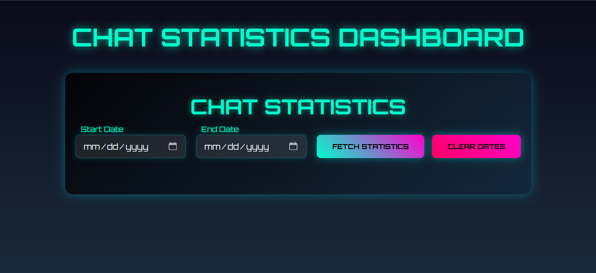
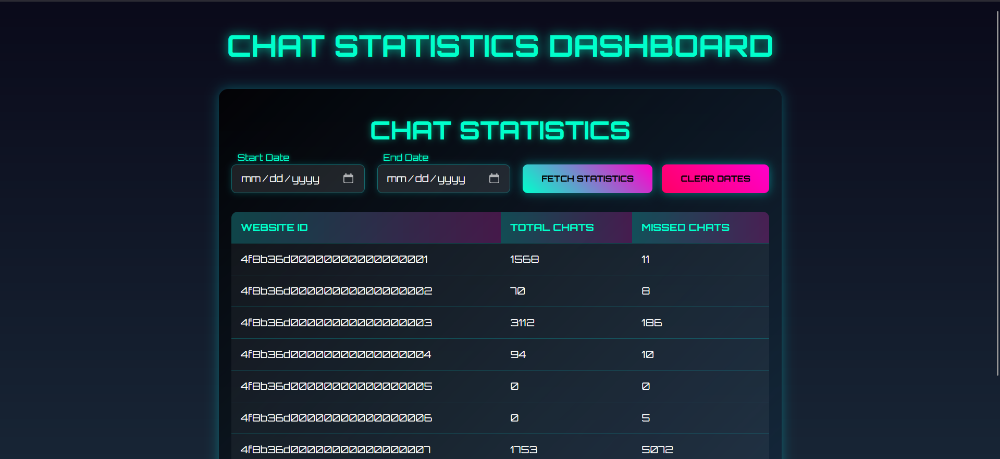

# Chat Statistics Application

A web application to fetch and display aggregated chat statistics from a JSON API, with a futuristic Vue.js frontend and a Node.js/Express backend. The frontend features a cyberpunk-inspired UI with neon gradients, animations, and a "Clear Dates" button for resetting date filters. The backend processes chat data, supporting optional date filtering.

## Technologies Used

### Backend
- **Node.js** (v20.18.2): JavaScript runtime
- **Express**: Web framework for API
- **node-fetch**: HTTP client for fetching JSON data
- **Jest**: Testing framework
- **jest-fetch-mock**: Mocking for HTTP requests
- **cors**: Middleware for cross-origin requests

### Frontend
- **Vue.js** (v3): Frontend framework
- **Vite**: Build tool and development server
- **Axios**: HTTP client for API requests
- **Vitest**: Testing framework
- **@vue/test-utils**: Utilities for testing Vue components
- **axios-mock-adapter**: Mocking for Axios requests
- **jsdom**: DOM environment for tests
- **CSS**: Custom styles with neon gradients, glassmorphism, and animations
- **Google Fonts (Orbitron)**: Futuristic font for UI

## 📸 Screenshots
- **Watch Demo**  

> Here's a glimpse of the application UI:

## 🛠️ Setup Instructions

Follow these steps to get the application up and running on your local machine.

### 1. Clone the Repository
### 2. Install Backend Dependencies
Navigate to the `server` directory and install dependencies:
- cd server
- npm install

### 3. Install Frontend Dependencies
Navigate to the nested client/client directory and install dependencies:
- cd client/client
- npm install

### 4. Verify Project Structure
Ensure the following files exist:
- **Backend: server/src/index.js, server/src/index.test.js**
- **Frontend: client/client/src/components/StatsViewer.vue, client/client/src/components/StatsViewer.test.js, client/client/runTestsAndLog.js**

### 5. Running the Application
- **1. Start the Backend** 
In the server directory:
- cd server
= npm start

- **2. Start the Frontend** 
In the client/client directory:
- cd client/client
- npm run dev

## Running Test Cases
- **1. Backend Tests** 
Navigate to the server directory
- Run Jest tests:
- npm test

- **2. Frontend Tests** 
Navigate to the client/client directory
- Run Vitest tests without logging:
- npm test

